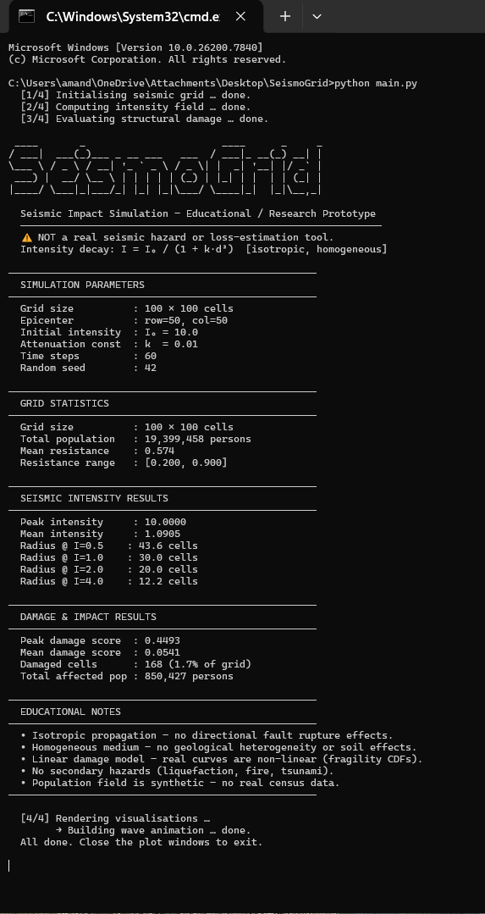
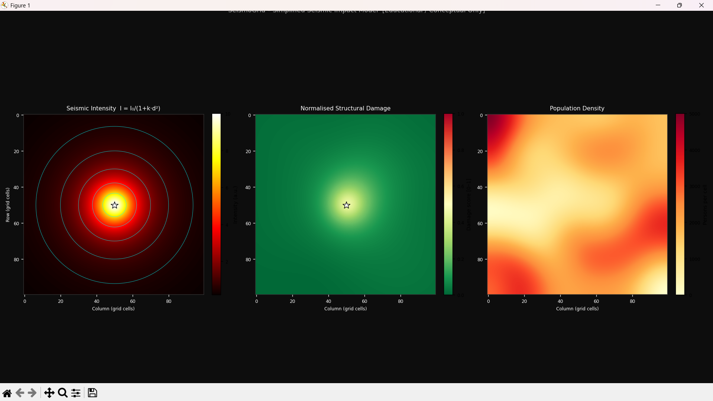
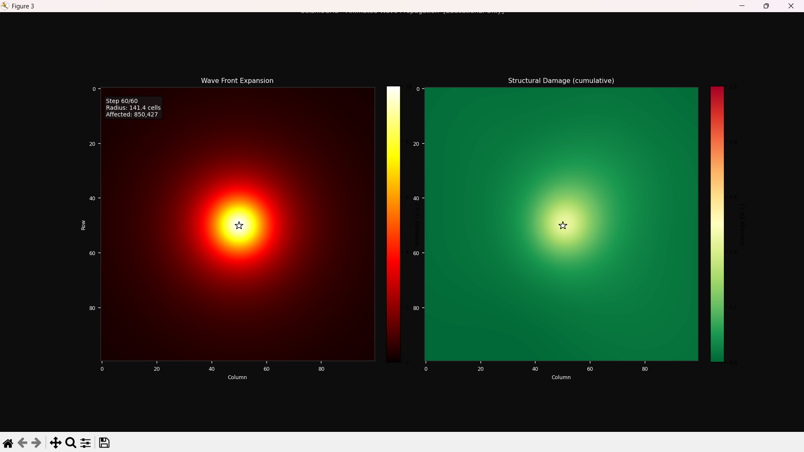
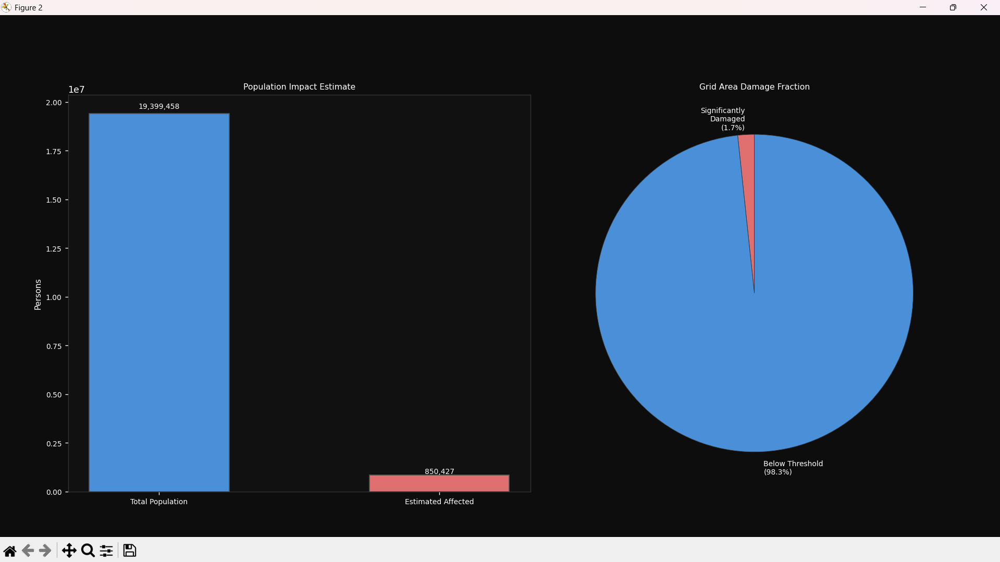

# 🌍 SeismoGrid

> A research-oriented earthquake impact simulation tool modeling seismic 
> wave propagation across a population grid.

SeismoGrid demonstrates how earthquake intensity decays over distance 
and estimates structural damage and affected regions using simplified 
physical principles.

⚠️ **This is a conceptual simulation for educational and analytical purposes — not a real-world prediction system.**

---

## 📸 Simulation Gallery

### 1. Epicenter & Parameter Generation
The simulation initializes with a detailed terminal output showing grid statistics, population density, and seismic intensity parameters.

<p align="center">
  
</p>

### 2. Wave Propagation Modeling
Real-time visualization of seismic waves as they move across the 2D geographic grid.

<p align="center">
  
</p>

### 3. Intensity Decay Mapping
Analysis of how intensity ($I$) dissipates based on the distance from the epicenter and the attenuation constant ($k$).

<p align="center">
  
</p>

### 4. Final Impact Analysis
A comprehensive breakdown of structural damage and the total affected population.

<p align="center">
  
</p>
---

## 🚀 Overview

SeismoGrid simulates:
* 🌋 **Earthquake epicenter generation**
* 🌊 **Seismic wave propagation**
* 📉 **Distance-based intensity decay**
* 🏙️ **Population distribution on a grid**
* 🏚️ **Structural damage estimation**
* 👥 **Affected population calculation**

The focus is scientific modeling and structured reasoning.

---

## 🧠 How It Works

1. A 2D grid represents a geographic region.
2. Each cell stores:
    * Population density
    * Structural resistance factor
3. An epicenter is defined.
4. Seismic waves expand outward.
5. Intensity decreases with distance.
6. Damage and population impact are computed per cell.
7. Results are visualized using `matplotlib` animations.

---

## 📐 Mathematical Model (Simplified)

### Intensity Decay
The simulation uses a simplified attenuation model to calculate the drop in seismic energy:

$$I = \frac{I_0}{1 + k \cdot d^2}$$

**Where:**
* $I$ = Intensity at distance $d$
* $I_0$ = Initial intensity at the epicenter
* $d$ = Distance from epicenter
* $k$ = Attenuation constant

### Damage Estimation
The vulnerability of a specific grid cell is determined by:

$$\text{Damage} \propto \text{Intensity} \times (1 - \text{Resistance})$$

---

## ✨ Features

- 🗺️ **Grid-based simulation engine**: Efficient spatial calculations using NumPy.
- 📊 **Intensity attenuation modeling**: Realistic (though simplified) energy dissipation.
- 🏗️ **Structural resistance calculation**: Model how different building codes affect outcomes.
- 👥 **Population impact estimation**: Quantitative analysis of affected residents.
- 🎞️ **Animated visualization**: Real-time rendering of wave propagation.

---

## 🛠️ Tech Stack

- 🐍 **Python 3**
- 🔢 **NumPy**
- 📈 **Matplotlib**

---

## 📦 Installation

```bash
git clone [https://github.com/amandeepintl/SeismoGrid.git](https://github.com/amandeepintl/SeismoGrid.git)
cd SeismoGrid
pip install -r requirements.txt
```

------------------------------------------------------------------------

## ▶️ Run the Simulation

``` bash
python main.py
```

------------------------------------------------------------------------

## 🎓 Educational Value

SeismoGrid demonstrates:

-   Applied mathematics\
-   Simulation modeling\
-   Data visualization\
-   Analytical reasoning\
-   Scientific assumptions and limitations

------------------------------------------------------------------------

## ⚠️ Limitations

-   Not a real predictive system\
-   Uses simplified physical models\
-   Does not include geological variability\
-   Not suitable for real disaster forecasting

------------------------------------------------------------------------

## 🔮 Future Improvements

-   🌄 Terrain-based intensity adjustments\
-   🗾 Real geographic data integration\
-   🌐 Multi-epicenter modeling\
-   🔁 Aftershock simulation\
-   📊 Advanced attenuation formulas

------------------------------------------------------------------------

## 📄 License

MIT License
